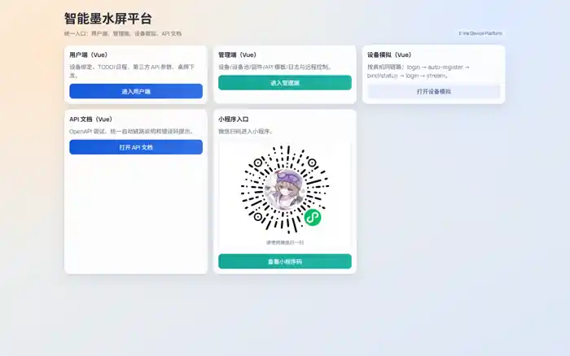
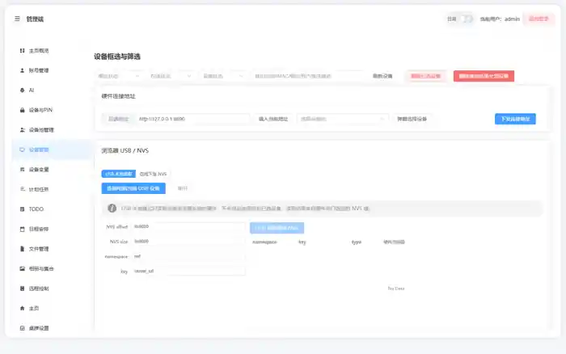
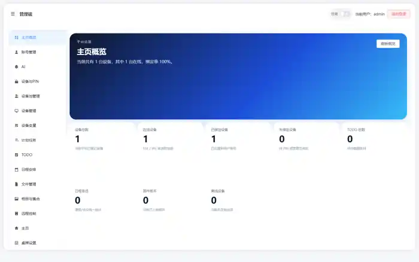
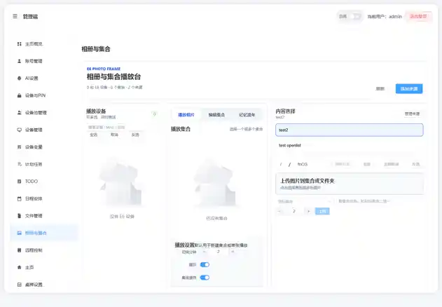
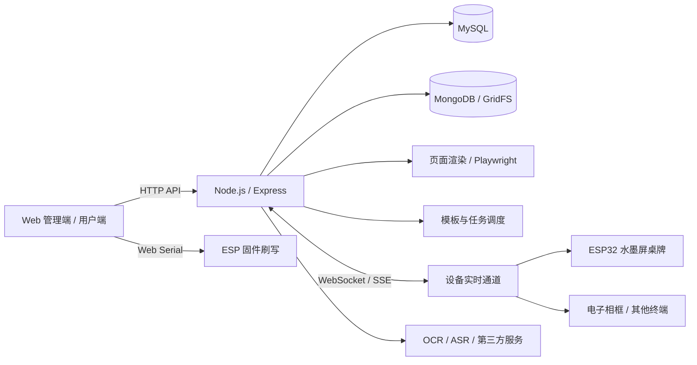

# 素墨屏语

> 面向电子墨水屏终端的内容、设备与远程管理平台。

素墨屏语是一套围绕 **E-Ink / 电子墨水屏设备** 构建的软硬件协同平台。项目以统一后台为中心，将 ESP32 桌牌、电子相框等终端接入同一套设备管理、内容渲染与远程下发链路，并提供 Web 管理端、用户端、设备模拟器、API 文档及扩展能力。

项目当前采用 **Node.js + Vue 3** 构建平台主体，并结合 WebSocket / SSE、Playwright、Web Serial、OCR 等能力，覆盖从设备注册、页面设计、模板渲染到固件刷写和内容推送的完整流程。

> 当前仓库为项目开发版本，功能仍在持续迭代中。

## 项目预览

### 平台入口



### 管理端概览


### 设备管理



### 主页配置与下发



### 相册与集合管理



## 核心能力

- **统一设备接入**：支持设备自动注册、PIN 绑定、状态查询、在线状态与实时连接管理。
- **多终端管理**：面向 ESP32 水墨屏桌牌、电子相框等不同形态终端，统一维护设备类型、分辨率和设备参数。
- **内容与页面管理**：支持主页、桌牌页、天气页等页面配置，并按设备分辨率生成预览与最终画面。
- **模板渲染**：支持模板变量、HTML/CSS、内联脚本及 legacy / web / hybrid 等渲染模式。
- **远程下发与控制**：支持切换页面、刷新画面、显示文本/图片、投屏以及设备 ACK 回执。
- **相册与集合**：可组织图片内容与播放集合，为电子相框等设备提供内容源。
- **固件管理与在线刷写**：维护固件库和版本标签，并通过浏览器 Web Serial / ESP Launchpad 对兼容 ESP 设备进行刷写。
- **课程表同步**：支持课程表导入及喜鹊课表同步，包含验证码 OCR 和自动更新流程。
- **第三方 API 模板**：通过模板方式接入外部数据，并按计划刷新和渲染到终端页面。
- **设备模拟器与 OpenAPI**：无需真实设备即可调试主要链路，同时提供 API 文档用于二次开发。

## 系统架构



## 技术栈

| 模块 | 技术 |
| --- | --- |
| Web 前端 | Vue 3、TypeScript、Vite、Element Plus、Pinia、Vue Router |
| 后端 | Node.js、Express |
| 实时通信 | WebSocket、SSE |
| 数据与文件 | MySQL、MongoDB / GridFS |
| 页面渲染 | Playwright / Chromium |
| 设备与固件 | ESP32 / ESP32-S3、Web Serial、ESP Launchpad |
| 辅助能力 | Python、OCR、第三方 API 模板 |

## 典型工作流

```text
设备上电
  ↓
auto-register / hardware login
  ↓
用户通过 PIN 绑定设备
  ↓
后台建立设备实时通道
  ↓
配置页面 / 模板 / 相册 / 课程表等内容
  ↓
服务端渲染并生成目标分辨率画面
  ↓
远程推送到水墨屏终端
  ↓
设备返回状态与 ACK
```

## 目录结构

```text
.
├─ backend/               # Node.js / Express 后端、设备通道与渲染服务
│  ├─ openapi/            # OpenAPI 文档
│  ├─ src/                # 路由、服务、数据库与实时通信
│  └─ tools/              # OCR / ASR 等辅助工具
├─ frontend-vue/          # Vue 3 + TypeScript 管理端源码
├─ frontend/              # 后端托管的 Web 静态资源 / 构建产物
├─ shared/                # 默认页面与共享配置
├─ scripts/               # 环境复现和维护脚本
├─ ico/                   # 天气图标等资源
└─ docs/                  # 项目文档与 README 插图
```

## 快速开始

### 1. 启动后端

```bash
cd backend
npm install
npm run start
```

默认硬件联调端口为 `8890`。生产环境请通过环境变量配置数据库、JWT、文件存储等参数。

### 2. 启动 Vue 前端

```bash
cd frontend-vue
npm install
npm run dev
```

### 3. 构建前端

```bash
cd frontend-vue
npm run build
```

Vite 构建结果可由后端静态托管。

### Linux / 容器环境

项目提供后端启动脚本，可完成部分运行环境的自举：

```bash
bash ./start.sh
```

## 主要接口域

- `auth`：账号与认证
- `devices / hardware`：设备注册、绑定和硬件通信
- `dashboard`：平台状态概览
- `homepages / badgepages / weatherpages`：页面配置和渲染
- `schedules`：课程表与同步
- `remote`：设备远程控制
- `firmware / firmware-flash`：固件库与刷写
- `templates`：API 模板与自动刷新
- `todos / tasks`：内容与任务
- `system-upgrade`：系统升级相关能力

完整接口以 `backend/openapi/openapi.yaml` 和后端路由实现为准。

## 项目定位

素墨屏语不是单一的“电子相框程序”，而是一个可扩展的 **水墨屏设备与内容管理平台**。后台负责设备、内容、模板、文件和任务，终端只需按照协议接入，即可复用统一的内容生产与推送能力。

目前项目重点覆盖桌牌、电子相框等场景，后续也可以继续扩展新的水墨屏尺寸、设备类型和业务页面。

## 开发说明

- 不要把 `.env`、数据库密码、Token、私钥等敏感配置提交到仓库。
- `node_modules`、本地运行产物、缓存和构建中间文件应保持在 Git 忽略列表中。
- 浏览器在线刷写依赖 Web Serial，建议使用支持该能力的 Chrome / Edge。
- 设备端与平台端联调时，应确保终端配置的后端地址和端口与实际部署一致。

## 名称

**素墨屏语**：以“素墨”对应电子墨水屏克制、低功耗的显示特性，以“屏语”表达不同屏幕终端通过同一平台传递信息与内容。
